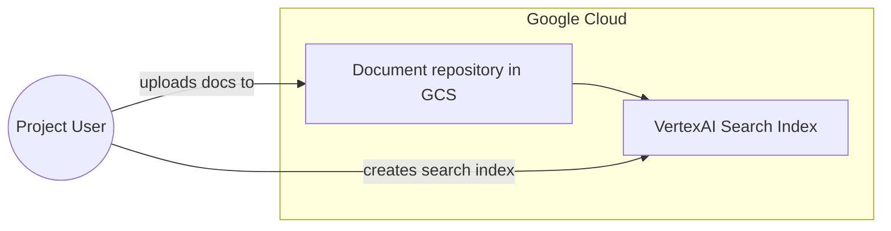
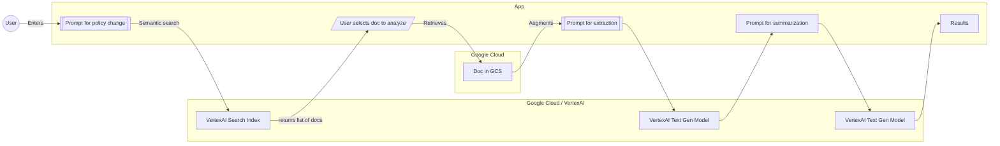

# Policy Change Helper 

The Policy Change Helper is a tool to help users understand the impact of policy changes on their documents. It uses semantic search to find documents that are similar to the one the user is interested in. It then uses text generation to generate a summary of the document and a summary of the changes between the document and the policy change.

## Architecture

The Policy Change Helper is a Streamlit app that uses VertexAI Search and VertexAI Text Generation.  The app uses Google Cloud Storage to store the documents.

### Project Setup


### App Flow


## Setup
```bash
python -m venv env
source env/bin/activate
pip install -r requirements.txt
```

## Set `.env` file
```bash
PROJECT = 'ppppppp'
LOCATION = 'llllllll'
DATASTORE = 'dddddddd'
BUCKET = 'bbbbbbbb'
```

## Auth Setup
```bash
gcloud auth application-default login
```

## Run
```bash
streamlit run App.py
```

## Docker
Set the env var `GOOGLE_APPLICATION_CREDENTIALS` to the credentials file created on `gcloud auth application-default login` (usually somewhere in ~/.config/gcloud/...)

Set `$REPO` to your artifact registry path, e.g. `$REGION-docker.pkg.dev/PROJECT_ID/REPO_NAME`

```bash
# Build
docker build -t $REPO/cloudrun-policy-change-helper:latest .

# Run
docker run --rm -it -p 8080:8080 \
-e GOOGLE_APPLICATION_CREDENTIALS=/tmp/keys/google_auth.json \
-v $GOOGLE_APPLICATION_CREDENTIALS:/tmp/keys/google_auth.json:ro \
$REPO/cloudrun-policy-change-helper:latest
```

Visit localhost:8080

### Deploy to Cloud Run
First build and push your docker image above to artifact registry. 
```bash
sudo 
```

Then:

```bash
gcloud run deploy $SERVICE_NAME --image $REPO/cloudrun-policy-change-helper:latest
```